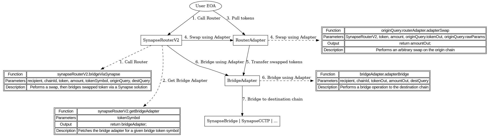
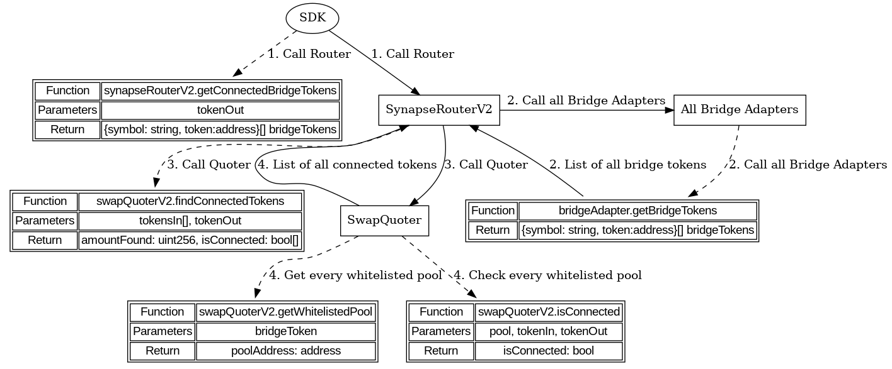
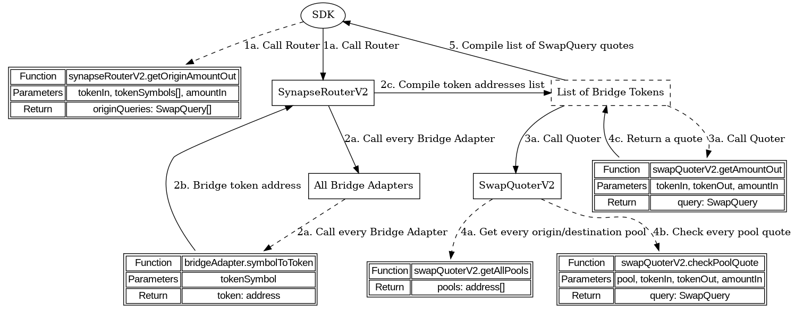

# SynapseRouterV2 workflows

## Bridging

Bridging is exposed using `SynapseRouterV2.bridgeViaSynapse()` method. User can specify the optional swap to be taken on both origin and destination chains.

### Function parameters

| Parameter   | Type      | Description                                                  |
| ----------- | --------- | ------------------------------------------------------------ |
| recipient   | address   | User address on the destination chain                        |
| chainId     | uint256   | Destination chain id                                         |
| token       | address   | Initial token address on the origin chain                    |
| amount      | uint256   | Initial token amount                                         |
| tokenSymbol | string    | Symbol of a token that will be bridged                       |
| originQuery | SwapQuery | Information about the optional swap on the origin chain      |
| destQuery   | SwapQuery | Information about the optional swap on the destination chain |

### `SwapQuery` structure

| Parameter     | Type    | Description                                                          |
| ------------- | ------- | -------------------------------------------------------------------- |
| routerAdapter | address | Address of the router adapter that will perform the swap             |
| tokenOut      | address | Token address that will be received after the swap                   |
| minAmountOut  | uint256 | Minimum amount of the token that will be received, or tx will revert |
| deadline      | uint256 | Deadline for the swap, or tx will revert                             |
| rawParams     | bytes   | Raw bytes parameters that will be passed to the router adapter       |

> For swaps using Default Pools `routerAdapter` is set to `synapseRouterV2` address, which inherits from `DefaultAdapter`. These are whitelisted pools that allow swaps between correlated tokens.
>
> - Alternative adapters can be used to perform complex swaps, but only on the origin chain.
> - Only whitelisted pools are allowed for destination swaps, therefore only `synapseRouterV2` can be used as `routerAdapter` on the destination chain.
> - `routerAdapter` for both `originQuery` and `destQuery` can be set to `address(0)`, which will skip the swap on the given chain.

> Note: `minAmountOut` and `deadline` are used to prevent front-running attacks.
>
> - If swap on origin chain fails, the whole transaction will revert, and no bridging happens.
> - If swap on destination chain fails, user receives the bridged token on destination chain instead of `tokenOut`.

### Bridging workflow

1. User calls `SynapseRouterV2.bridgeViaSynapse()` method on the origin chain.
   > User needs to approve `SynapseRouterV2` for spending `token` before calling this method.
2. Based on the `tokenSymbol` the address of the Bridge Adapter supporting given symbol is determined.
   > - `originQuery.tokenOut` needs to match `tokenSymbol`, or the transaction will revert.
   > - Transaction will also revert, if `tokenSymbol` is not supported by any Bridge Adapter.
3. `(token, amount)` is pulled from the user, and transferred to the `originQuery.routerAdapter`.
4. `originQuery.routerAdapter` is called to perform a swap on the origin chain.
   > - Swap from `token` to `originQuery.tokenOut` will be performed.
5. The Router Adapter performs a swap, and transfers `tokenOut` to the `BridgeAdapter` contract.
   > - Note: if `originQuery.routerAdapter` is empty, steps 3-5 are skipped, and `(token, amount)` is pulled from user to the `BridgeAdapter` contract instead.
6. `BridgeAdapter` is called to initiate the bridging to destination chain.

## Quoting the bridge transaction

Bridge quotes are exposed via Router SDK, which is interacting with `SynapseRouterV2` contracts in order to generate the quote, as well the parameters for the bridge transaction,
which include `SwapQuery` structs. This is covered by the `routerSDK.bridgeQuote()` function.

### Function parameters

| Parameter     | Type      | Description                              |
| ------------- | --------- | ---------------------------------------- |
| originChainId | number    | Origin chain id                          |
| destChainId   | number    | Destination chain id                     |
| tokenIn       | string    | Initial token address on origin chain    |
| tokenOut      | string    | Final token address on destination chain |
| amountIn      | BigintIsh | Initial token amount                     |

### Function return values

| Value         | Type      | Description                                                                                   |
| ------------- | --------- | --------------------------------------------------------------------------------------------- |
| feeAmount     | BigNumber | Bridge fee amount that will be taken by the protocol                                          |
| feeConfig     | feeConfig | Fee configuration for the used bridge token                                                   |
| routerAddress | string    | Address of the router contract on the origin chain                                            |
| maxAmountOut  | BigNumber | Amount of the tokens to receive on the destination chain (after bridge fees, before slippage) |
| originQuery   | SwapQuery | Information about the swap on the origin chain                                                |
| destQuery     | SwapQuery | Information about the swap on the destination chain                                           |

### `SwapQuoterV2` overview

`SwapQuoterV2` is a periphery contract for `SynapseRouterV2`, which contains the information about the pools that are used for bridging (and quoting). This contracts tracks two categories of pools:

1. Pools that could be used for swaps on origin chain only.
2. Pools that could be used for swaps on both origin and destination chains. These pools are mapped to a bridge token, therefore a given bridge token could only have one whitelisted pool.

Pools from both categories must implement `IDefaultPool` interface, but their internal logic might be more complex. For example, `LinkedPool` contracts implement this interface, but under the hood they aggregate a collection of pools into one big pool.

### High-level bridge quote workflow

1. `destChain.SynapseRouterV2` is called to fetch the list of bridge symbols that could be used to receive `tokenOut` on the destination chain.
2. `originChain.SynapseRouterV2` is called to fetch the list of quotes for swaps from `tokenIn` to the bridge tokens denoted by the symbols from step 1. Only pre-configured pools are used for this step.
3. `destChain.SynapseRouterV2` is called to fetch the list of quotes for swaps from the bridge tokens to `tokenOut`, assuming quotes from step 2 are bridged to the destination chain. Only whitelisted pools are used for this step.
   > The returned quote will include the bridging fee that will be taken by the protocol.
4. The best overall quote is selected, and corresponding `SwapQuery` structs from steps 2 and 3 are returned.

> Note: to include the alternative Adapters in the quoting process, following steps need to be taken before going to step 3:
>
> - `adapterSDK.quoteSwap()` is called to fetch the list of quotes for swaps from `tokenIn` to the bridge tokens denoted by the symbols from step 1. All the trade paths supported by the given adapter could be used for this step. Note that every Adapter might have a different API for fetching the quotes.
> - Quotes from step 2 are replaced with the better quotes from the adapter.

### Low-level bridge quote workflow

#### 1. Fetching the list of bridge symbols (destination chain)

1. SDK calls `synapseRouterV2.getConnectedBridgeTokens()` method on the destination chain.
2. `SynapseRouterV2` fetches the list of supported bridge symbols (and corresponding bridge token addresses) and the from every supported `BridgeAdapter` contract.
3. `SwapQuoterV2` is called with this list and `tokenOut` to determine which tokens from the list are connected to `tokenOut` by the whitelisted pools.
4. This is done by checking the whitelisted pool for every token from the list, and checking if the pool supports `tokenOut`.

#### 2. Fetching the list of quotes for swaps from `tokenIn` to the bridge tokens (origin chain)

1. SDK calls `synapseRouterV2.getOriginAmountOut()` method on the origin chain, supplying the list of symbols from step 1.
2. For every token in the list `SynapseRouterV2` fetches the token address from the supported `BridgeAdapter` contracts.
3. `SwapQuoterV2` is called with `tokenIn` and `bridgeTokenOut` to determine the best quote for the swap from `tokenIn` to `bridgeTokenOut`. It is also given instructions that this is a quote for the origin swap.
4. `SwapQuoterV2` checks both "origin only" and "origin and destination" pools for the best quote.
5. List of quotes for every token in the list is compiled in `SynapseRouterV2` and returned.

#### 3. Fetching the list of quotes for swaps from the bridge tokens to `tokenOut` (destination chain)

1. SDK calls `synapseRouterV2.getDestinationAmountOut()` method on the destination chain, supplying the list of symbols from step 1, and the list of quotes (amounts in) from step 2.
2. For every bridge token symbol, `SynapseRouterV2` fetches the token address from the supported `BridgeAdapter` contracts, as well as the bridge fee for the given `amountIn`.
3. For every token in the list that has `feeAmount < amountIn`, `SwapQuoterV2` is called with `bridgeTokenIn` and `tokenOut` to determine the best quote for the swap from `bridgeTokenIn` to `tokenOut`. It is also given instructions that this is a quote for the destination swap. `amountIn - feeAmount` is used as the initial token amount for the quote.
4. `SwapQuoterV2` checks only "origin and destination" pools for the quote using a whitelisted pool for the given bridge token.
5. List of quotes for every token in the list is compiled in `SynapseRouterV2` and returned.

