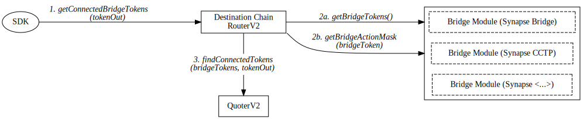
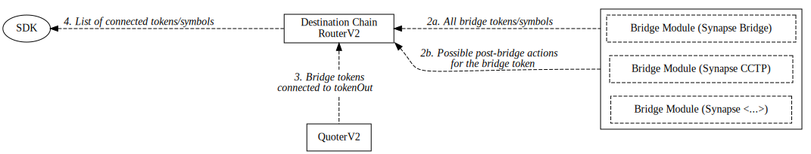

# SynapseRouterV2 workflows

## Bridging

Bridging is exposed using `SynapseRouterV2.bridgeViaSynapse()` method. User can specify the optional swap to be taken on both origin and destination chains.

### Function parameters

| Parameter   | Type      | Description                                                  |
| ----------- | --------- | ------------------------------------------------------------ |
| recipient   | address   | User address on the destination chain                        |
| chainId     | uint256   | Destination chain id                                         |
| token       | address   | Initial token address on the origin chain                    |
| amount      | uint256   | Initial token amount                                         |
| tokenSymbol | string    | Symbol of a token that will be bridged                       |
| originQuery | SwapQuery | Information about the optional swap on the origin chain      |
| destQuery   | SwapQuery | Information about the optional swap on the destination chain |

- `tokenSymbol`, `originQuery`, and `destQuery` could be obtained by interacting with `SynapseRouterV2` contracts on both origin and destination chains, which is covered in the [Quoting the bridge transaction](#quoting-the-bridge-transaction) section.
- `tokenSymbol`, `originQuery`, and `destQuery` are also returned by `routerSDK.bridgeQuote()` function, which abstracts the bridging workflow from the SDK consumer.

### Bridging workflow (high-level)

1. Swap from `token` into a bridge token represented by `tokenSymbol` is performed on the origin chain, according to the parameters encoded in `originQuery`.
   > This step will be omitted, if `token` is already a bridge token represented by `tokenSymbol` on origin chain.
2. Token represented by `tokenSymbol` is bridged to the destination chain.
3. Swap from token represented by `tokenSymbol` into the end token is performed on the destination chain, according to the parameters encoded in `destQuery`.
   > This step will be omitted, if the bridge token represented by `tokenSymbol` on destination chain is already the end token.
4. End token is transferred to the `recipient` address on the destination chain.

### `SwapQuery` structure

| Parameter     | Type    | Description                                                          |
| ------------- | ------- | -------------------------------------------------------------------- |
| routerAdapter | address | Address of the router adapter that will perform the swap             |
| tokenOut      | address | Token address that will be received after the swap                   |
| minAmountOut  | uint256 | Minimum amount of the token that will be received, or tx will revert |
| deadline      | uint256 | Deadline for the swap, or tx will revert                             |
| rawParams     | bytes   | Raw bytes parameters that will be passed to the router adapter       |

`SwapQuery` structure is used to encode the parameters for the swap that will be performed on the given chain. It is used for both origin and destination chain swaps. While these structs could be constructed manually, it is recommended to use `routerSDK.bridgeQuote()` function to obtain them. Alternatively, one could interact with `SynapseRouterV2` contracts directly.

- A separate contract `routerAdapter` is used to perform the swap.
  > For swaps using Default Pools `routerAdapter` is set to `synapseRouterV2` address, which inherits from `DefaultAdapter`. These are whitelisted pools that allow swaps between correlated tokens.
  >
  > - Alternative adapters can be used to perform complex swaps, but only on the origin chain.
  > - Only whitelisted pools are allowed for destination swaps, therefore only `synapseRouterV2` can be used as `routerAdapter` on the destination chain.
  > - `routerAdapter` for both `originQuery` and `destQuery` can be set to `address(0)`, which will skip the swap on the given chain. This might be necessary if user wishes to start from the bridge token on origin chain, or end with the bridge token on destination chain.
- `minAmountOut` and `deadline` are used to prevent front-running attacks.
  > - If swap on origin chain fails, the whole transaction will revert, and no bridging happens.
  > - If swap on destination chain fails, user receives the bridged token on destination chain instead of `tokenOut`.
- `rawParams` is used to pass the information about how exactly the swap needs to be performed to the `routerAdapter`.
  > Different adapters will implement different encoding for the `rawParams`.

### Bridging: calls flow

1. User calls `SynapseRouterV2.bridgeViaSynapse()` method on the origin chain.
   > User needs to approve `SynapseRouterV2` for spending `token` before calling this method.
2. Router Adapter method `adapterSwap()` is called based on `originQuery` parameters provided by the user.
3. One of bridge modules is used to bridge the swapped token to the destination chain. This is achieved by doing a delegate call to the `BridgeModule` contract, which implements the bridging logic.
   > - `BridgeModule` contract is determined based on the `tokenSymbol` provided by the user.
   > - `destQuery` parameters provided by the user are are used to request the specific swap on the destination chain.

### Bridging: token flow

1. Input tokens are pulled from user to `RouterAdapter` contract prior to calling `adapterSwap()` method.
2. After the swap is performed, the swapped tokens are transferred to `SynapseRouterV2` contract.
3. During the initiation of bridging the swapped tokens are pulled from `SynapseRouterV2` contract to the bridge contract (e.g. `SynapseBridge`), then bridged to the destination chain.

## Quoting the bridge transaction

Bridge quotes are exposed via Router SDK, which is interacting with `SynapseRouterV2` contracts in order to generate the quote, as well the parameters for the bridge transaction,
which include `SwapQuery` structs. This is covered by the `routerSDK.bridgeQuote()` function.

### Function parameters

| Parameter     | Type      | Description                              |
| ------------- | --------- | ---------------------------------------- |
| originChainId | number    | Origin chain id                          |
| destChainId   | number    | Destination chain id                     |
| tokenIn       | string    | Initial token address on origin chain    |
| tokenOut      | string    | Final token address on destination chain |
| amountIn      | BigintIsh | Initial token amount                     |

### Function return values

| Value         | Type      | Description                                                                                   |
| ------------- | --------- | --------------------------------------------------------------------------------------------- |
| feeAmount     | BigNumber | Bridge fee amount that will be taken by the protocol                                          |
| feeConfig     | feeConfig | Fee configuration for the used bridge token                                                   |
| routerAddress | string    | Address of the router contract on the origin chain                                            |
| maxAmountOut  | BigNumber | Amount of the tokens to receive on the destination chain (after bridge fees, before slippage) |
| originQuery   | SwapQuery | Information about the swap on the origin chain                                                |
| destQuery     | SwapQuery | Information about the swap on the destination chain                                           |

### `SwapQuoterV2` overview

`SwapQuoterV2` is a periphery contract for `SynapseRouterV2`, which contains the information about the pools that are used for bridging (and quoting). `SwapQuoterV2` functions are exposed in the `SynapseRouterV2` contract, so for the end user there is no need to interact with `SwapQuoterV2` directly. The following documentation describes how Router and Quoter contracts interact with one another, which is abstracted away when one interacts with `SynapseRouterV2` contract or the SDK.

`SwapQuoterV2` tracks two categories of pools:

1. Pools that could be used for swaps on origin chain only.
2. Pools that could be used for swaps on both origin and destination chains. These pools are mapped to a bridge token, therefore a given bridge token could only have one whitelisted pool.

> Pools from both categories must implement `IDefaultPool` interface, but their internal logic might be more complex. For example, `LinkedPool` contracts implement this interface, but under the hood they aggregate a collection of pools into one big pool.

### High-level bridge quote workflow

1. `SynapseRouterV2` on destination chain needs to be called to fetch the list of bridge token symbols that could fullfil `tokenIn -> tokenOut` cross-chain swap.
2. `SynapseRouterV2` on origin chain is called to fetch the list of `SwapQuery` quotes for swaps on origin chain that could fullfil `tokenIn -> tokenOut` cross-chain swap.
3. `SynapseRouterV2` on destination chain is called to fetch the list of `SwapQuery` quotes for swaps on destination chain that could fullfil `tokenIn -> tokenOut` cross-chain swap.
   > The returned quote will include the bridging fee that will be taken by the protocol.
4. The best overall quote is selected, and corresponding `SwapQuery` structs from steps 2 and 3 are returned, as well as the bridge token symbol.

> Note: to include the alternative Adapters in the quoting process, following steps need to be taken before going to step 3:
>
> - `adapterSDK.quoteSwap()` is called to fetch the list of alternative `SwapQuery` quotes for swaps on origin chain using this alternative adapter.
> - Quotes from step 2 are replaced with the better quotes from the adapter.

### Low-level bridge quote workflow

#### 1. Fetching the list of bridge symbols (destination chain)

1. SDK calls `synapseRouterV2.getConnectedBridgeTokens()` method on the destination chain.
   > This passes `tokenOut` as a parameter to `SynapseRouterV2` contract.
2. `SynapseRouterV2` calls every supported `BridgeModule` to get a list of all module's bridge tokens and their symbols.
   > All lists are then merged into one list of bridge tokens/symbols.
3. `SwapQuoterV2` is called to determine which tokens from the list are connected to `tokenOut` by the whitelisted pools.
4. List of connected bridge tokens and their symbols is returned.

_Below are the diagrams for the function and data flows for this step._

#### 2. Fetching the list of quotes for swaps from `tokenIn` to the bridge tokens (origin chain)

1. SDK calls `synapseRouterV2.getOriginAmountOut()` method on the origin chain.
   > This passes list of symbols from step 1, as well as `tokenIn` and `amountIn` to `SynapseRouterV2`.
2. `SynapseRouterV2` fetches the token addresses and maximum bridgeable amounts from the supported `BridgeModule` contracts.
3. `SwapQuoterV2` is called with to determine the best quote between `tokenIn` and every bridge token in the list.
   > `SwapQuoterV2` checks both "origin only" and "origin and destination" pools for the best quote.
4. List of quotes for every token in the list is compiled in `SynapseRouterV2` and returned.
   > The quotes that exceed the maximum amount of the token that could be bridged are filtered out.

_Below are the diagrams for the function and data flows for this step._

#### 3. Fetching the list of quotes for swaps from the bridge tokens to `tokenOut` (destination chain)

1. SDK calls `synapseRouterV2.getDestinationAmountOut()` method on the destination chain.
   > This passes list of symbols from step 1, list of amounts in from step 2, and `tokenOut` to `SynapseRouterV2`.
2. `SynapseRouterV2` fetches the token addresses and respective fee amounts from the supported `BridgeModule` contracts.
3. `SwapQuoterV2` is called with to determine the best quote between every bridge token in the list and `tokenOut`.
   > - `SwapQuoterV2` checks only bridge token's "whitelisted destination pool" for the best quote.
   > - Amount after the bridge fee is used as the initial token amount for the quote.
4. List of quotes for every token in the list is compiled in `SynapseRouterV2` and returned.
   > The quotes with initial amount less than the bridge fee are filtered out.

_Below are the diagrams for the function and data flows for this step._

